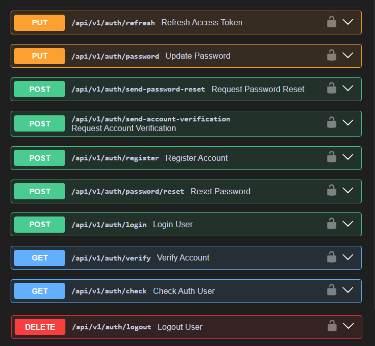
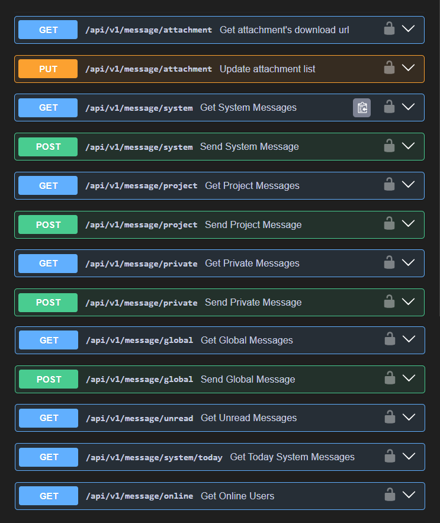
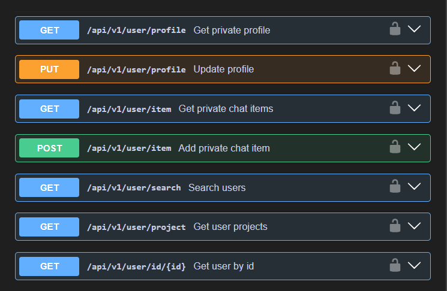
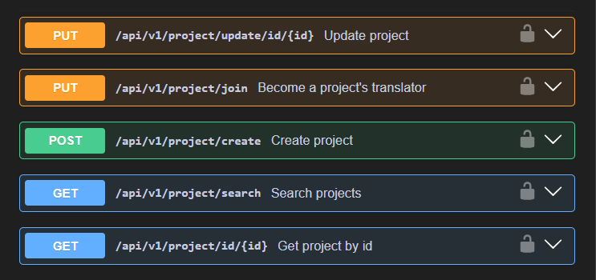
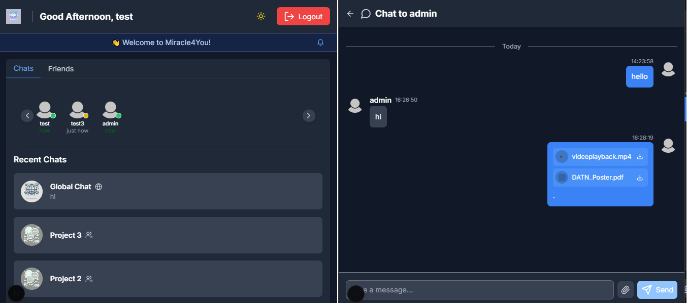

# Miracle4You

**Miracle4You** is a collaborative platform where language lovers can come together to create subtitles for meaningful videos, helping them reach a wider audience. The platform is designed to facilitate discussions, streamline the subtitling process, and present the work beautifully.

This project also serves as a hands-on opportunity to build a scalable and performant Java backend server using the Spring Boot framework.

## 🚀 Backend (Java + Spring Boot)

- **Framework**: Spring Boot, Java
- **Database**: PostgreSQL with Hibernate, Data Projections, and Custom Queries
- **Caching**: L2 Hibernate Cache, Caffeine Cache
- **Authentication**: Spring Security with JWT and Google Login
- **Real-time Communication**: WebSocket with SockJS & StompJS for Global, Group, and Private Chat, etc.
- **File Storage**: AWS S3 Integration for Avatar Uploads and Sending Attachments
- **Email Service**: JavaMail with Thymeleaf Templates
- **API Documentation**: Swagger

## 📚 API Documentation

Detailed API documentation is available via Swagger after running the project.
 
Auth apis:
 

  
Message apis:
 

  
User apis:
 

  
Project apis:
 

## 🌐 Frontend (Next.js)

A Next.js app was built to test Google Login and WebSocket features. You can check it out here: [Miracle4You](https://miracle4you.vercel.app)

## 📌 Upcoming Features

The project is still under development. There are many functions I want to add in the future:

- Complete Notification system
- Enhance Project managements
- Add Subtitle, Comment, Post relating features
- Integrate new collaboration tools: Real-time editing
- etc.

## 💌 Contact

If you’d like to contribute, give feedback, or just say hi, feel free to reach out!

Thanks for visiting my project — have a nice day! 🌼
